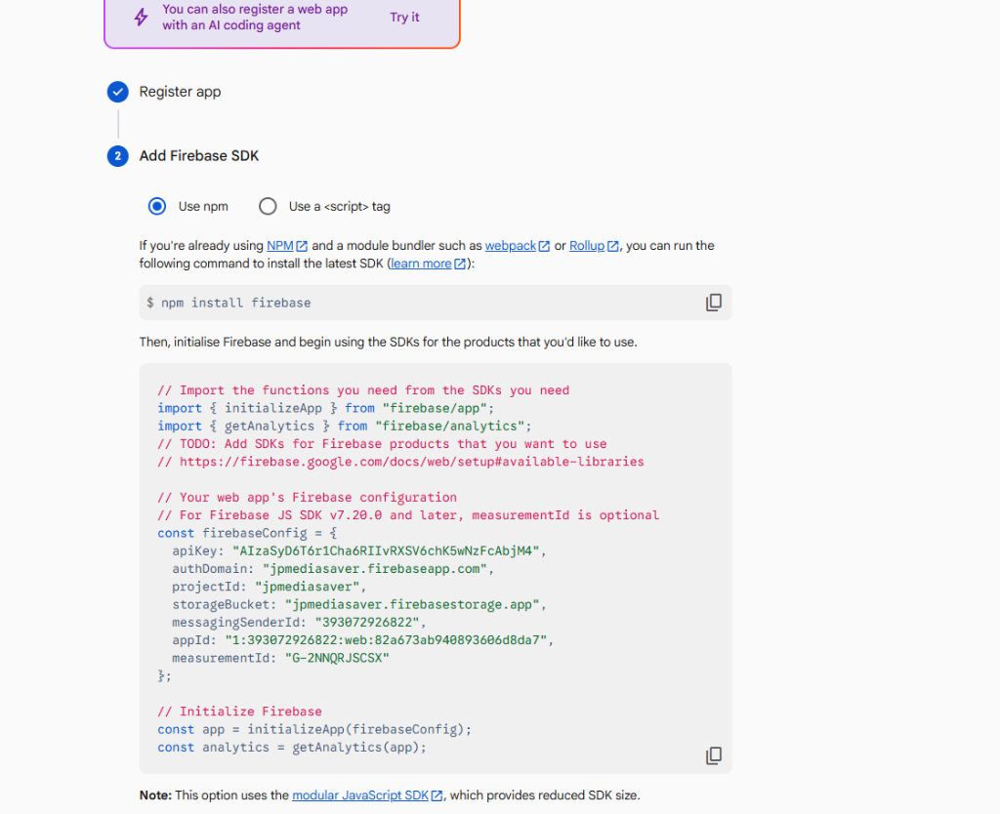

<div align="center">

  

  # JPMediaSaver
  ### Jayaprabhu Universal Social Media Downloader

  <p align="center">
    A fast, modern, and privacy-first web application for extracting and downloading media from YouTube, Instagram Reels, TikTok, Facebook, Twitter/X, Pinterest, and more.
  </p>

  <p align="center">
    <a href="https://jpmediasaver.web.app" target="_blank">
      
    </a>
    
    
    
    
    
  </p>

  <p align="center">
    <b>🌐 Official Live Website:</b> <a href="https://jpmediasaver.web.app">https://jpmediasaver.web.app</a>
  </p>

</div>

---

## 📸 Visual Showcase

### 1. Cinematic Brand Entrance (5-Second Logo Reveal)
When opening the site, visitors are welcomed with an elegant, glowing 5-second brand reveal for **Jayaprabhu Creations** with a synchronized animated progress indicator and quick-skip option.

<div align="center">
  
</div>

---

### 2. Universal Media Extraction Interface
Sleek dark-mode interface built with Tailwind CSS, supporting automatic link paste, instant platform detection, stream selection, and video/audio downloads.

<div align="center">
  
</div>

---

### 3. Integrated Creator Support & Donations

<div align="center">

| 🇮🇳 UPI / PhonePe (India) | 🌍 PayPal (International) |
| :---: | :---: |
| <br><br><b>UPI ID:</b> <code>vickyunion99@ibl</code><br><b>Payee Name:</b> VIKAS PRABHU GUDARAD<br><i>Scan with PhonePe, Google Pay, Paytm, BHIM</i> | <br><br><a href="https://www.paypal.com/donate?business=gudaradvikas09@gmail.com&no_recurring=0&currency_code=USD" target="_blank"></a><br><br><b>PayPal Account:</b><br><code>gudaradvikas09@gmail.com</code><br><br><i>Supports Credit Cards, Debit Cards & PayPal Balance</i> |

</div>

---

## 🚀 Key Features

* **Multi-Platform Support**: Downloads video and audio from YouTube (Shorts & long videos), Instagram Reels/Stories, TikTok (without watermark), Facebook, Twitter/X, Pinterest, Reddit, and more.
* **100% Serverless on Google Cloud**:
  * Frontend hosted on **Firebase Hosting** with global CDN caching.
  * Backend runs on **Firebase Cloud Functions (2nd Gen Python)** with auto-scaling and zero server maintenance.
* **Unified Domain Architecture**: Both frontend and backend serve from `jpmediasaver.web.app`, eliminating CORS problems.
* **Custom Support / Donation Options**:
  * Indian supporters can pay any custom INR amount directly to PhonePe/GPay UPI (`vickyunion99@ibl`).
  * International supporters can donate any custom USD amount via official PayPal checkout.
* **Strict 100% Non-Adult & Clean Ad Integration**:
  * Monitored Adsterra 728x90 banner and native recommendations with adult/gambling filters active.
* **Zero Data Retention Policy**: We do not store downloaded files or search history; media streams directly from CDNs.
* **Download History Tracking**: Optional local storage and Firebase Firestore user history synchronization.

---

## 🛠️ Architecture & Tech Stack

| Layer | Technologies |
| :--- | :--- |
| **Frontend** | Vanilla JavaScript (ES6+), Tailwind CSS (CDN), FontAwesome 6, Plus Jakarta Sans |
| **Backend** | Python 3.10, FastAPI, `yt-dlp`, `pytubefix`, `a2wsgi`, Firebase Admin SDK |
| **Cloud & Deployment** | Google Firebase Hosting, Firebase Cloud Functions (2nd Gen / Cloud Run) |
| **Payment Integrations** | UPI Deep-Linking (`upi://pay`), PayPal Donate |
| **Monetization** | Adsterra (Filtered clean 728x90 Banner, Native Recommendations) |

---

## 📂 Project Structure

```
social-media-downloader/
├── frontend/                     # Static Web App (Firebase Hosting root)
│   ├── index.html                # Main UI with Tailwind & Modals
│   ├── app.js                    # Core client logic & API handlers
│   ├── style.css                 # Glassmorphic styles & CSS keyframes
│   ├── firebase-config.js        # Firebase Client SDK initialization
│   ├── payment-config.js         # UPI and PayPal donation configuration
│   ├── logo.jpg                  # Jayaprabhu Creations emblem
│   └── images/                   # Book covers, QR banners & assets
├── functions/                    # 2nd Gen Firebase Cloud Functions (Python)
│   ├── main.py                   # Serverless ASGI function entrypoint
│   ├── requirements.txt          # Python dependencies for Cloud Functions
│   └── app/                      # Application backend logic
│       ├── main.py               # FastAPI application definition
│       ├── extractors/           # Platform-specific extractors (yt-dlp)
│       └── models.py             # Pydantic data schemas
├── backend/                      # Standalone / Local development backend
├── docs/screenshots/            # High-resolution README preview images
├── firebase.json                 # Firebase Hosting & Function rewrites
├── .firebaserc                   # Firebase project bindings (jpmediasaver)
└── .gitignore                    # Environment & credential exclusions
```

---

## ⚡ Quickstart (Local Development)

### 1. Clone the repository
```bash
git clone https://github.com/vikasgudarad09-hue/social-media-downloader.git
cd social-media-downloader
```

### 2. Run the Backend locally
```bash
cd backend
python -m venv venv
# On Windows:
.\venv\Scripts\activate
# On macOS/Linux:
source venv/bin/activate

pip install -r requirements.txt
uvicorn app.main:app --reload --port 8000
```

### 3. Open the Frontend
Open `frontend/index.html` in your browser (or use VS Code Live Server). The frontend will automatically route requests to `http://localhost:8000` when running locally!

---

## ☁️ Deployment to Firebase

To deploy both the frontend and backend directly to Google Cloud:

```bash
# 1. Login to Firebase CLI
firebase login

# 2. Deploy to live project
firebase deploy
```

---

## ☕ Support the Creator

If you find **JPMediaSaver** helpful, feel free to support ongoing server and development costs:

* **UPI (India 🇮🇳)**: `vickyunion99@ibl` (*VIKAS PRABHU GUDARAD*)
* **PayPal (Global 🌍)**: [gudaradvikas09@gmail.com](https://www.paypal.com/donate?business=gudaradvikas09@gmail.com&no_recurring=0&currency_code=USD)
* **Created by**: **Jayaprabhu Creations**

---

## 📄 License

This project is licensed under the [MIT License](LICENSE).
